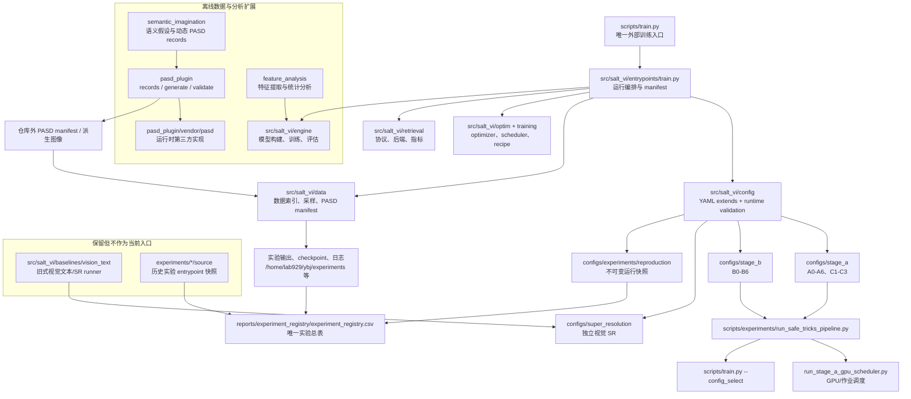

# SALT-VI 架构审计与重整记录

审计日期：2026-08-19（Asia/Shanghai）
审计基线：`9d425e94e6df5e79759a93cd5b725d9675726c33`
审计分支：`codex/salt-structure-audit-20260819`

## 1. 当前边界

本仓库是 SALT-VI 的源码、配置和可追溯实验索引。数据集、预训练权重、训练
checkpoint、原始日志和 PASD 模型资产属于服务器运行资产，不作为源码树的一部分。

当前受 Git 管理的规模为 419 个文件，其中 Python 233 个、YAML/YML 133 个、Markdown
15 个。仓库外的运行资产约 37 GB，其中 checkpoint 约 30 GB、PASD 运行资产约 6.3 GB；
这些资产本轮不删除。

## 2. Mermaid 框架图

### 入口与 trick 切换

configs/pipelines/sysu_safe_tricks.yaml 是变体注册表。调度器根据 --variant 或 list 读取对应 YAML；代码分支不随 trick 切换。Stage-A 统一从 a0_resolution_aligned_512.yaml 继承，A1-A6 和 C1-C3 只覆盖自己的参数、实验 ID、事件文件和输出根。Stage-B 的 b0 继承历史 Stage-B 基线，b1、b2、b4-b6 继承 b0，b3 在 b2 上追加 LLRD。启动器把 checkpoint、SHA-256、输出根等运行时值注入后统一调用 scripts/train.py。

## 3. 模块审计

| 区域 | 结论 | 处理 |
| --- | --- | --- |
| `src/salt_vi/` | 当前唯一主实现，训练/数据/模型/评估边界清晰 | 保留 |
| `scripts/train.py` + `src/salt_vi/entrypoints/train.py` | 唯一训练入口，但入口文件约 1,190 行，聚合了 manifest、checkpoint、评估和训练编排 | 本轮不拆；列为下一轮高优先级拆分 |
| `src/salt_vi/engine/build.py` | 模型装配约 987 行，仍包含历史 checkpoint 家族兼容逻辑 | 本轮不删除，需先以运行矩阵证明可移除分支 |
| `src/salt_vi/data/dataset.py` | 数据适配约 911 行，兼容 SYSU/RegDB/LLCM、文本和 PASD 视图 | 保留，下一轮按 dataset/protocol 拆分 |
| `src/salt_vi/baselines/vision_text/` | 被视觉文本基线和 SR 预检/启动脚本直接引用；虽不打包进 wheel，但不是死代码 | 保留并明确为隔离 runner |
| `pasd_plugin/` | 当前离线 PASD 入口；`pasd_plugin/vendor/pasd` 被 `runtime.py` 直接导入 | 保留 |
| `semantic_imagination/` | 独立包，有实验入口和测试，不被训练主线自动启用 | 保留，继续保持离线边界 |
| `feature_analysis/` | 独立分析包，有 CLI 和测试，不修改训练代码 | 保留，继续保持离线边界 |
| src/salt_vi/data/processing.py:ChannelAdap | 仅在基线中存在、仓库与配置/测试均无引用，功能由 ChannelAdapGray/ChannelExchange 覆盖 | 已移除 23 行重复旧增强实现 |
| `vendor/legacy_code/` | 未纳入 Git、无当前代码导入、无运行进程引用的旧 baseline/source_core | 已迁移至仓库外日期归档 |
| `experiments/*/source/` | 历史运行 entrypoint 快照，供实验 provenance 使用；不是当前入口 | 保留，后续可在 registry 稳定后迁出源码树 |

没有发现非初始化文件的完全重复 Python/YAML 文件。初始化文件的重复是包结构所需，
不作为冗余删除目标。

### 累层补丁风险

当前风险集中在三个聚合点：训练入口、模型装配、数据适配。代码中仍有 `legacy`
metric/retrieval alias、旧 checkpoint 文件名识别和历史数据属性兼容，但这些分支都有
对应的契约测试或历史配置引用，不能仅凭命名删除。下一轮应以“先写迁移器/兼容期，
再删分支”的方式拆分，避免破坏已登记结果的复现能力。

## 4. 历史文档、过时配置和缓存

### 已处理

1. 主工作树中 68 个 `__pycache__`/`.pytest_cache` 目录已清除；当前运行实验位于独立
   worktree，未受影响。
2. `vendor/legacy_code`（约 68 MB）已迁移至：
   `/home/lab929/ybj/archive/salt-vi-legacy-code-20260819`。未删除，可恢复。
3. `.gitignore` 中针对已迁出目录的失效规则已移除，避免旧树静默回流。
4. CI 中已经删除的 `pasd_offline` 引用已改为当前 `pasd_plugin`，包括测试和
   compileall 目标。
5. AST/全文引用复核确认 ChannelAdap 为孤儿类，已移除；_parse_best_ir_records 不删除，因为仍由 Stage-A checkpoint 选择路径调用。

### 保留理由

- `reports/experiment_registry/`、`configs/experiments/reproduction/` 和
  `experiments/*/source/` 共同承担实验可追溯性，不以“历史”名义删除。
- `reports/evidence/`、`checkpoints/`、`pretrained/`、`logs/` 和 PASD checkpoint 是
  运行/证据资产，本轮不裁剪权重、不删除日志。
- 归档配置中的旧绝对路径是历史事实的一部分；不把它们改写成当前路径，否则会改变
  复现语义。新的可运行配置应逐步迁移到环境变量/仓库相对路径。

## 5. 后续重整计划

### P0：入口收敛

将 `entrypoints/train.py` 拆为 `run_manifest.py`、`checkpoint_io.py`、
`evaluation_loop.py` 和薄入口；保持 `scripts/train.py` CLI 不变。每次拆分后运行
runtime contracts、safe-tricks focused tests 和 CLI help。

### P1：配置分层

保留 `configs/stage_a`、`configs/stage_b`、`configs/super_resolution` 作为唯一可运行
入口；把新增实验只写入 `configs/experiments/reproduction/` 快照，不再复制“当前状态”
Markdown。为可运行配置增加 `${SALT_VI_ROOT}` 等路径变量，归档配置继续原样保存。

### P2：历史 runner 迁移

待实验总表的 source 快照和 archive manifest 完整核验后，把已完成实验的
`experiments/*/source/` 迁到仓库外的只读 provenance archive；仓库内只保留当前 runner
和索引。迁移前必须逐行检查 registry 的 `source`/`config`/`code_commit` 字段。

### P3：兼容分支退役

在完整运行矩阵确认后，逐步退役旧 checkpoint filename、legacy retrieval alias 和
旧数据属性；每一项都需要迁移说明、测试覆盖和回滚提交，不能一次性清空。

## 6. 验收标准

- `git diff --check` 通过；工作树只包含本轮有意修改。
- CPU CI 不再引用 `pasd_offline`；`pasd_plugin`、核心 SALT 和 semantic-imagination
  测试可独立运行。
- `python -m compileall -q src scripts experiments pasd_plugin semantic_imagination feature_analysis` 通过。
- 本轮全量测试结果：163 passed；scripts/train.py --help 与 safe-tricks pipeline list 均成功。
- 当前 C3 batch=96 训练进程仍只运行在独立 worktree/GPU1；Stage-A 输出、checkpoint、
  日志和实验总表未被清理动作改写。
- 主工作树不再含 `vendor/legacy_code`、Python/pytest 缓存；归档目录存在且约 68 MB。
- Stage-B 默认输入、实验 registry 和历史证据路径未被本次结构整理自动改写。
