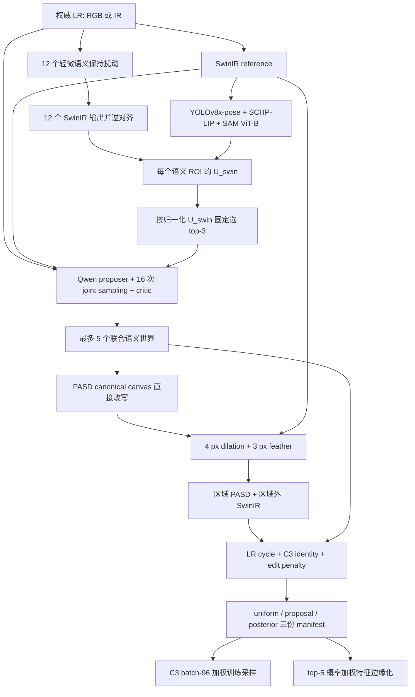

# Qwen Regional Imagination v1

QRI-v1 是 `semantic_imagination` 下的并行区域插件，不替换原来的 atomic sampler。它把 Qwen 的角色从“随机选择一个标签”升级为 evidence-aware proposer、joint-world sampler 和 independent critic，并且把经验频率保留为 proposal mass，而不是宣称为现实后验概率。

当前 GGUF 和 projector 作为第三方资产登记：`Qwen3.8-27B-UD-Q4_K_XL.gguf` + `mmproj-F16.gguf`。代码和报告不得把它表述为官方 Qwen 27B 型号。



## 固定实验契约

- RGB 与 IR 都进入同一条区域插件。
- SwinIR 预算固定为 12 个扰动：亮度 ±2%、对比度 ±2%、JPEG Q95、四个 1 像素平移、Gaussian blur σ=0.3、resize 0.98/1.02 后恢复。
- ROI 候选覆盖原 taxonomy；不训练 uncertainty segmentation。每张图无阈值地选择归一化 `U_swin` 最高的三个 ROI。`U_qwen` 记录为归一化多假设熵，但不作为进入门槛。
- Qwen 为三个 ROI 先提出 2–4 个互斥候选，再进行 16 次联合世界采样。critic 以最多四个 world 的固定小批次校验，避免长 JSON 截断；它丢弃 contradicted 世界，保留并标记 compatible-prior-only，最终最多保留 5 个世界。
- llama.cpp 请求显式传入 `enable_thinking=true` 与 `reasoning_effort=high`；插件只持久化结构化 evidence/candidate/critic 结果，不保存内部 reasoning 文本。
- `absent` / `no_additional_detail` 不产生编辑 mask。全 abstain 世界直接复制 SwinIR，不运行 PASD。
- PASD v1 仍整图生成；输入必须是与 SwinIR/ROI mask 共用坐标的 256×512 canonical
  canvas，adapter 使用 `direct_rewrite`，不再执行人物检测、letterbox、模糊背景填充或
  背景恢复；最终使用 soft mask 复合，不修改 diffusion latent。
- calibrated weight 固定为：`log p = log(q + 1e-8) - 8 E_LR - 4 E_ID - 16 E_edit + const`。
- 任一源图像处理失败时，只输出一张 SwinIR world，三种权重均为 1，并在 source metadata 中保留错误审计。
- 训练使用动态视图、paired sampling；测试对按权重排序的 top-5 world feature 先逐一归一化、加权求和，再归一化最终 feature。少于 5 个世界时使用零权重 padding，不增加概率质量。

## 目录与接口

- `semantic_imagination/regional/`：区域插件实现；重依赖均为惰性加载。
- `configs/qri_v1_sysu.yaml`：生成期唯一正式配置。
- `configs/pasd_sysu_qri_v1.yaml`：QRI 专用 PASD `direct_rewrite` 配置，使用绝对共享 checkpoint 路径与既有资产哈希，不依赖当前 Git worktree 的位置。
- `../configs/stage_a/semantic_imagination/`：三个彼此隔离的 C3-b96 训练配置。
- `../configs/pipelines/sysu_qri_v1.yaml`：预注册的 smoke、pilot、训练和测试契约。
- `../scripts/experiments/run_qri_v1_pipeline.py`：只读计划/预检/显式训练入口；正式训练必须提供含 `train_epoch=23` 的 C3-b96 event stream。
- `../scripts/experiments/build_qri_v1_llama_server.py`：固定 llama.cpp revision、CUDA 12.4、sm86 自动检测与最多 16 个编译 job 的可复现构建入口；默认只打印计划。
- `../scripts/experiments/smoke_qri_v1_qwen.py`：把一张真实图送入本机多模态 endpoint，并对结构化视觉 JSON 响应做严格检查。

输出根目录下每个 source 有独立 metadata、ROI mask、world mask、完整 PASD 图和最终复合图。`manifests/` 同时写出：

- `regional.jsonl`：完整区域/推理/critic/能量审计；
- `manifest.uniform.jsonl`；
- `manifest.proposal.jsonl`；
- `manifest.posterior.jsonl`；
- 对应 `.json` 完整性摘要及 `category_u_swin_stats.json`。

三份 SALT manifest 引用同一组像素文件，仅切换 `hypothesis_weight`，因此权重对照不会重复生成数据或互相污染。

## 运行门槛

生成环境必须显式提供并通过 checksum 的 SwinIR、YOLOv8x-pose、官方 SCHP-LIP checkpoint、SAM ViT-B、Qwen GGUF/mmproj 和固定 C3 identity checkpoint。SCHP 通过固定 revision 的 `Self-Correction-Human-Parsing` 源码惰性加载，不向 SALT 环境复制其网络实现。Qwen 通过启用视觉 projector 的本机 `llama-server` 提供 OpenAI-compatible multimodal endpoint；只加载 GGUF 而未加载 mmproj 会被视为无效部署。

先执行：

```text
salt-qri serve --config semantic_imagination/configs/qri_v1_sysu.yaml
salt-qri serve --config semantic_imagination/configs/qri_v1_sysu.yaml --gpu 3 --execute
salt-qri preflight --config semantic_imagination/configs/qri_v1_sysu.yaml
QRI_OUTPUT_ROOT=.../smoke32 salt-qri run --config semantic_imagination/configs/qri_v1_sysu.yaml --device cuda:1 --limit 32 --fail-fast
QRI_OUTPUT_ROOT=.../pilot512 salt-qri run --config semantic_imagination/configs/qri_v1_sysu.yaml --device cuda:1 --limit 512
QRI_OUTPUT_ROOT=.../formal salt-qri run --config semantic_imagination/configs/qri_v1_sysu.yaml --device cuda:1 --split all --category-stats .../pilot512/manifests/category_u_swin_stats.json
```

第一条只打印并校验固定服务命令；第二条才会在配置指定的单卡上以前台方式启动
`llama-server`。服务固定加载 GGUF 与 `mmproj`、单并发、8192 context、K/V `q8_0`
cache；因此不会出现误启动为纯文本模型的静默降级。Qwen 默认独占 GPU3，SwinIR/ROI/PASD/C3 identity 栈默认运行在 GPU1；运行时可在允许的 GPU1–3 内用 `--gpu` 与 `--device` 改映射，并且两者必须选择不同空闲卡。当前 v1 不把约 18 GB 的 Qwen 与 PASD 同塞一张 24 GB 卡，避免静默 OOM 或 CPU offload 改变吞吐口径。

32-source smoke 使用 fail-fast 暴露接口问题；512-source train-only pilot 启用逐源 SwinIR fallback，并产出正式 category median/IQR。三者使用不同输出根；正式生成使用 `--split all` 覆盖训练图、全部 IR query 与所有可能进入十次 single-shot gallery 的 RGB 测试图，并通过 `--category-stats` 固定 train-only pilot 统计。统计内容哈希进入 build ID，因此不会把不同归一化口径的缓存混在一起，也不会用测试分布估计归一化参数。全量生成完成且 C3-b96 固定末轮完成后，才允许 `run_qri_v1_pipeline.py train --execute`。三个正式实验均为 24 epochs，并只报告 epoch 23；`automatic_promotion=false`。
